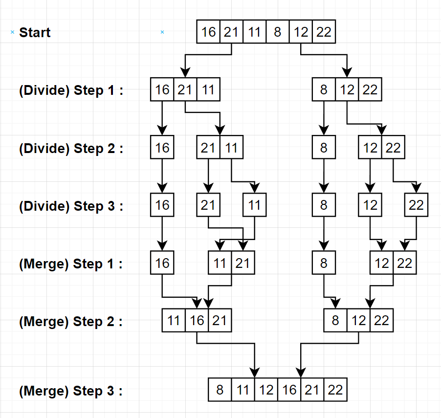

# Merge Sort
[16,21,11,8,12,22]  
# Tasks
- [ ] Stages of the above array according to the merge sort type.
- [ ] Big-O notation

<h4>
  
- [x] Stages of the above array according to the merge sort type.
  
</h4>

<h4>
  
- [x] Big-O notation
  
</h4>    

Answer : O(nlogn) = (6log6) 
 

Merge Sort algorithm is divide and conqueror algorithm. Time complexity of merge sort algorithm is O(nlogn). Since the divide and conquer algorithms are not linear and are operated by dividing into two.
 
 
n² > nlogn because the logarithm of n is < n. So it is smaller than n². In other words, divide and conquer algorithms are faster than linear sorting algorithms such as big o notation n², n. (like selection, bubble, insertion) 
 
 
There may not be much difference in series consisting of a small number of data, but as the data increases, if there are data such as 1 million or 10 million, the difference is obviously.
 
 
The big-o notation of the merge sort algorithm is n(log(n)) for average, best, worst cases. 
 
 
The logic of the Merge Sort algorithm is as follows:
Phase of divide- > Divide into smallest pieces.
Phase of conquer  -> Sort when combining. (It's called "Merge" because of the combining phase.
 
 
So the answer is ->
` O(n log(n)) = O(6log6)`
